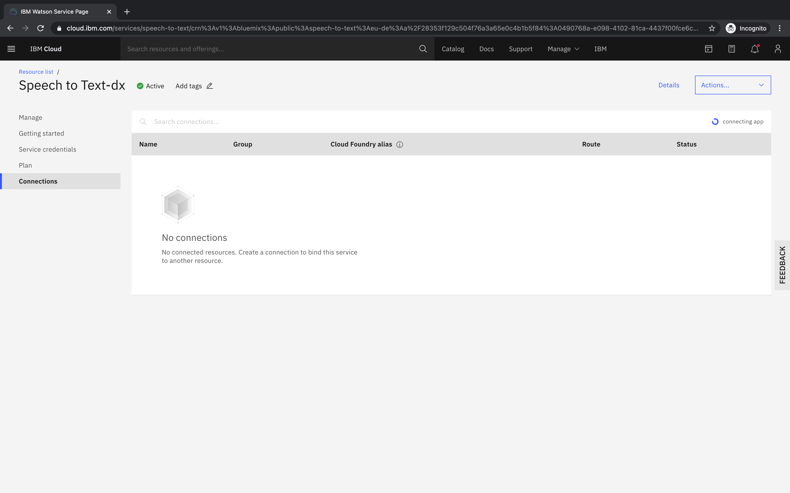

## Connect Watson Services

To ease the integration between the Node-RED application and the Watson services, we show how bind these to your CloudFoundry (Node-RED) application.

### Prerequisites
- Logged in to IBM Cloud
- Created Node-RED app
- Created lite plan service instances for Watson Speech to Text, Watson Language Translator, Watson Text to Speech

### Steps
- Open the [IBM Cloud resource list](https://cloud.ibm.com/resources), select your "Watson Speech to Text" instance

- Switch to Connections

- Select Create connection

- Select the CloudFoundry Application to connect to (Node RED) and choose next

- Click Create

- Wait and confirm to restarge the app

- Repeat the above steps for "Watson Language Translator" and "Watson Text to Speech"

Finally, open the resource list, select your Node-RED app in the "Cloud Foundry apps" category and switch to "Connections"
- You should see all services you previously connected

