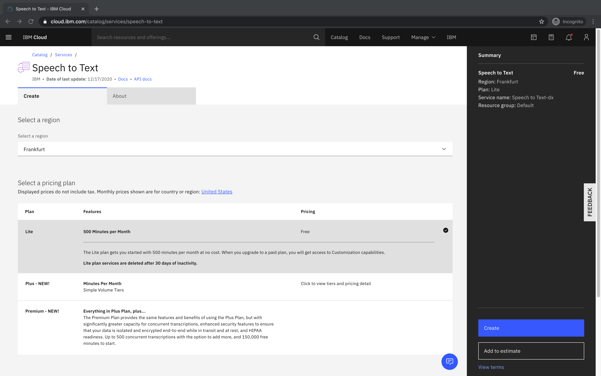

## Create Watson Services

Three Watson AI services, all available in the IBM Cloud Lite tier, are needed to build a universal translator:

- Watson Speech to Text
- Watson Language Translator
- Watson Text to Speech

### Prerequisites
- Logged in to IBM Cloud

### Steps
- Open the [IBM Cloud catalog](https://cloud.ibm.com/catalog), search for "Watson Speech to Text" and select the matching service

- Choose a nearby region (i.e. Frankfurt) and click create to create a lite plan instance

- Repeat the above steps for "Watson Language Translator" and "Watson Text to Speech"
