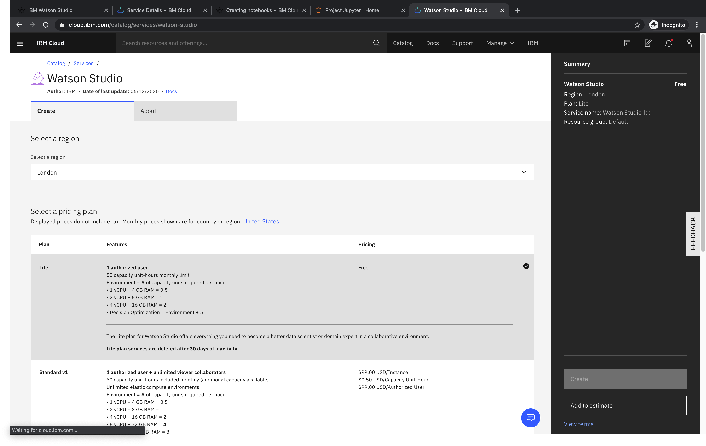
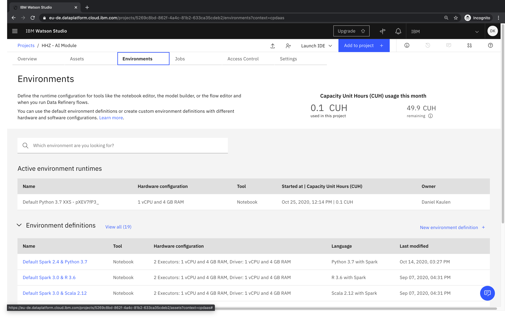

# How long can I use Watson Studio for free?

- With a free "Lite" plan, you will get a a monthly limit of 50 capacity-unit hours.

- Remaining Capacity Unit Hours (CUH) can be checked via the the _Environments_ tab of your project

The smallest environment runtime consumes 0.5 CUH per hour (i.e. it can be used 100 hours for free per month).

### Related Links
- [Documentation - Runtime usage](https://dataplatform.cloud.ibm.com/docs/content/wsj/analyze-data/track-runtime-usage.html)
