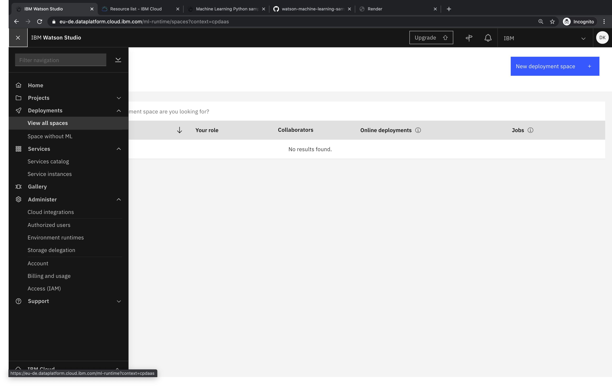
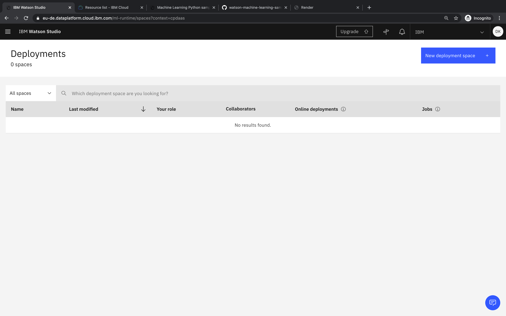
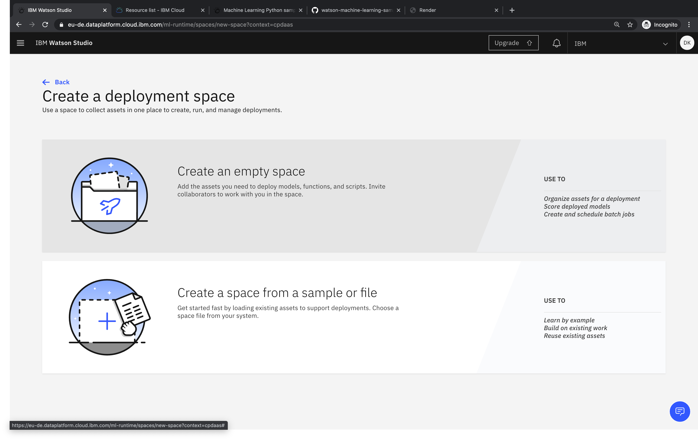
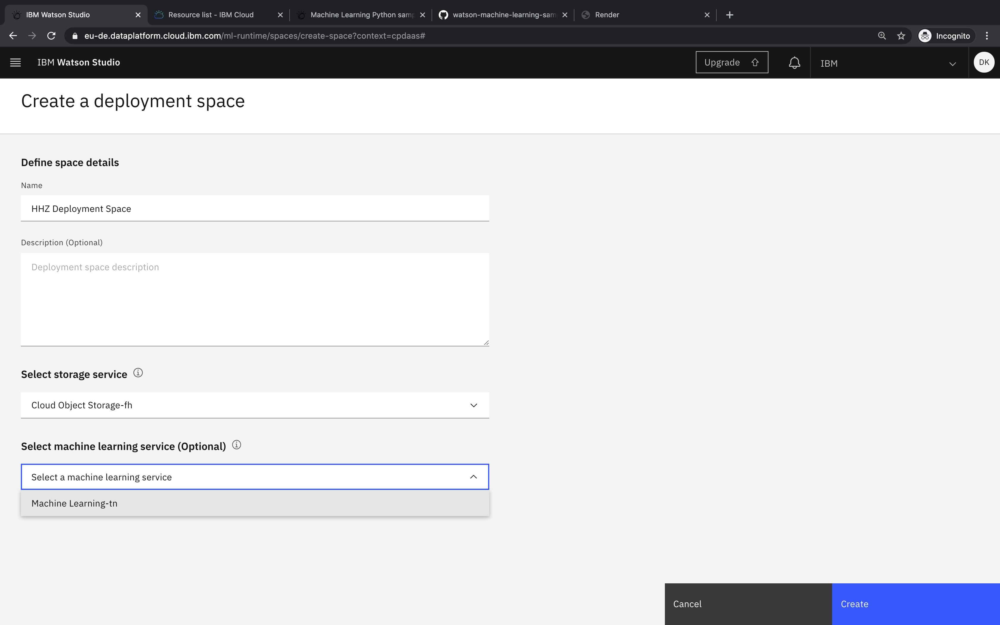
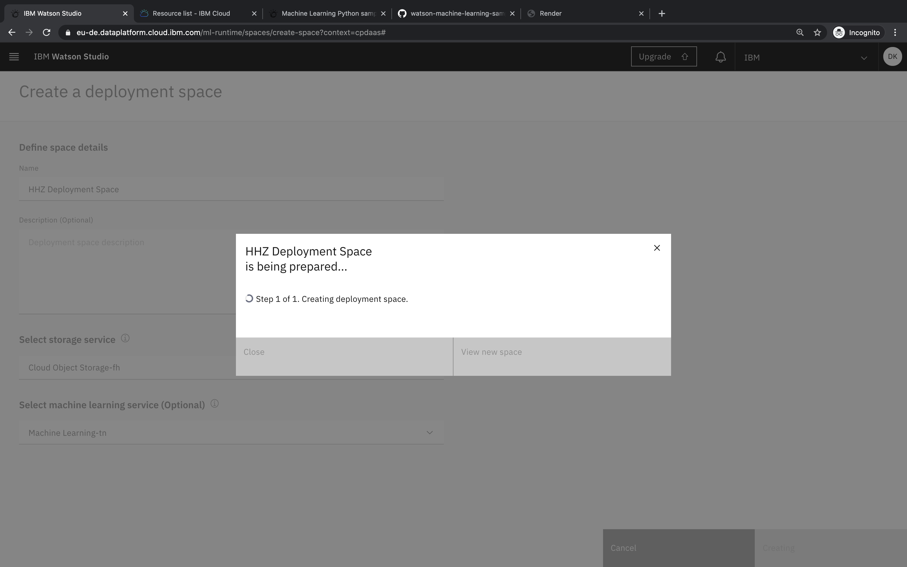
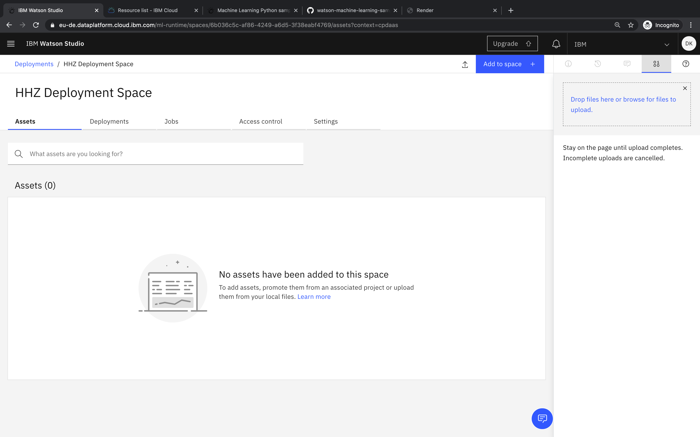
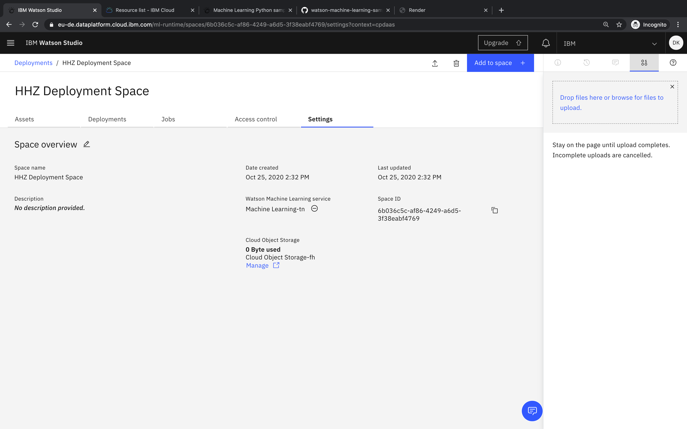

## How can I create a new deployment space and retrieve the space ID?

- Select _View all spaces_ in the menu

- Select _New deployment space_

- Select _Create an empty space_

- Add a name and choose a machine learning service

- Click View new space

- Switch to the _Settings_ tab

- Copy the Space ID when needed

### Related links
- [Documentation - Deployment Spaces](https://dataplatform.cloud.ibm.com/docs/content/wsj/analyze-data/ml-spaces_local.html)
- [Documentation - Terminology](https://dataplatform.cloud.ibm.com/docs/content/wsj/analyze-data/ml-terminology.html)
