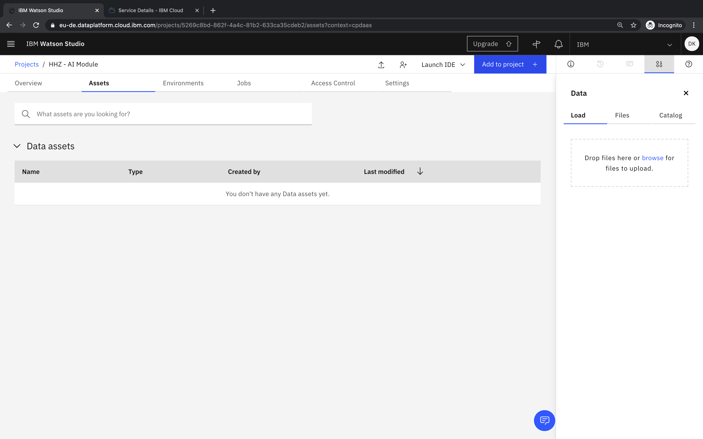
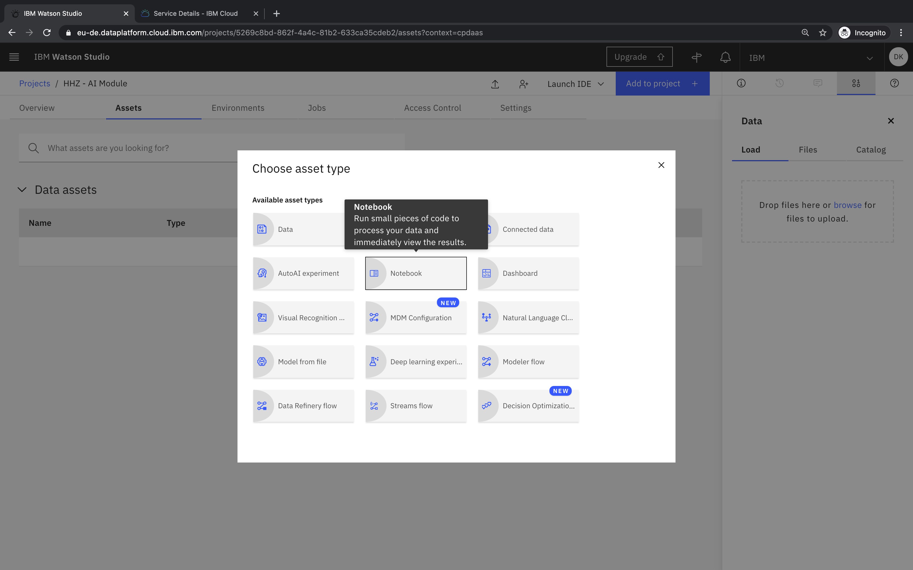
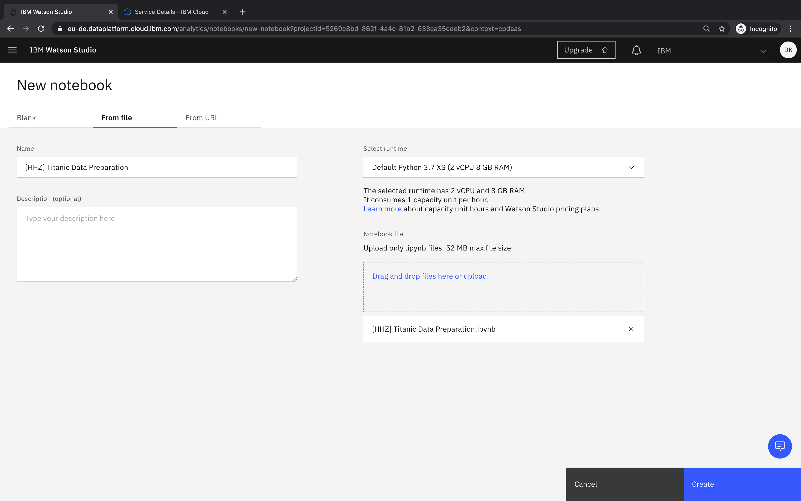
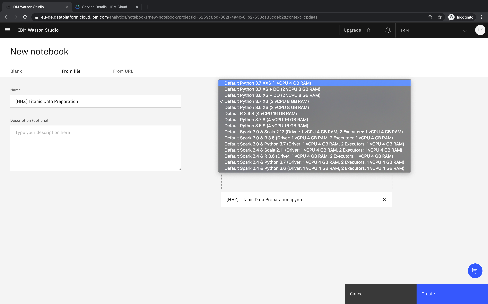
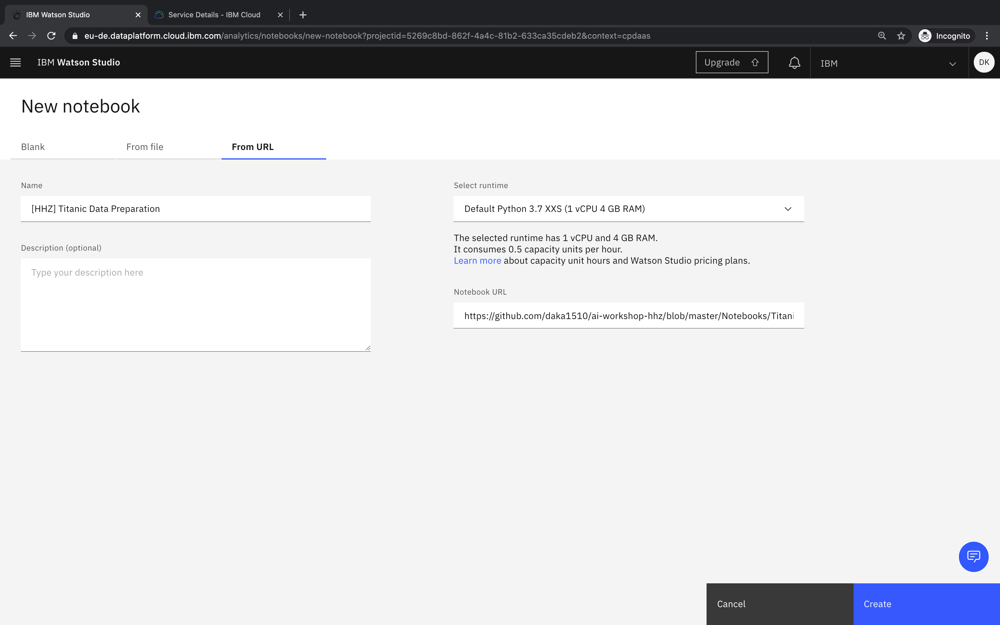
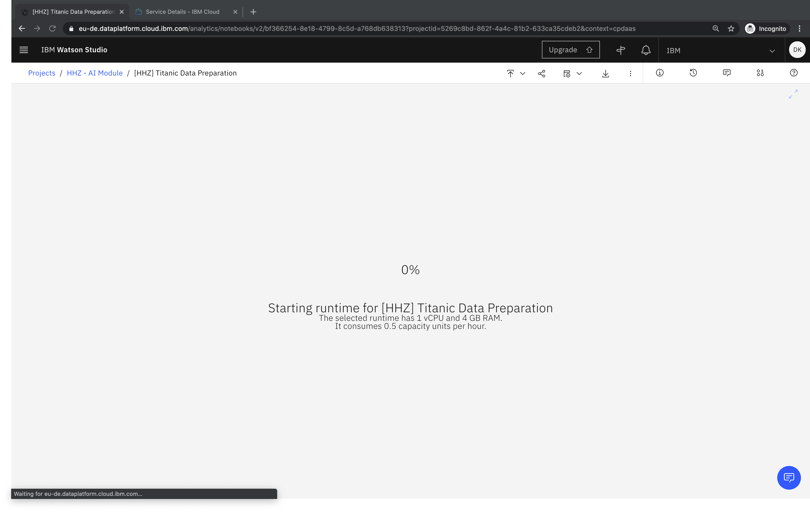
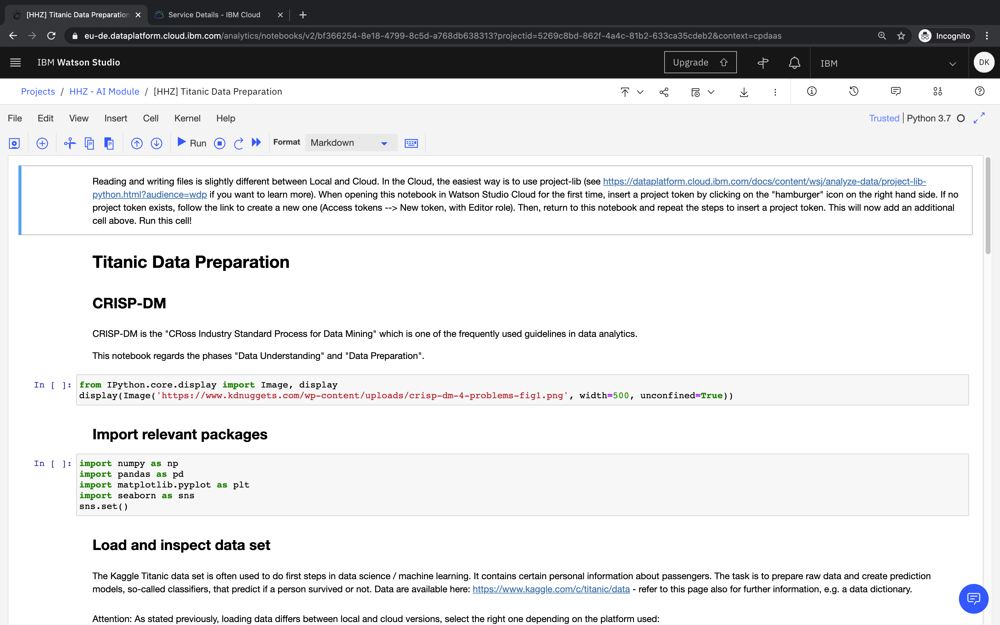

## How can I create a new notebook?

- Access your project
- Click _Add to project_ in the navigation bar

- Choose _Notebook_ as asset type

- You can choose to create a new empty notebook, or create a notebook from an existing file or URL. The "Default Python 3.7 XXS" runtime offers enough resources to work through the exercises.

- Click _Create_ to create and start the notebook

- Once the runtime is started, you are able to edit and execute cells of the notebook

### Related Links
- [Documentation - Creating notebooks](https://dataplatform.cloud.ibm.com/docs/content/wsj/analyze-data/creating-notebooks.html)
- [Project Jupyter](https://jupyter.org/)
