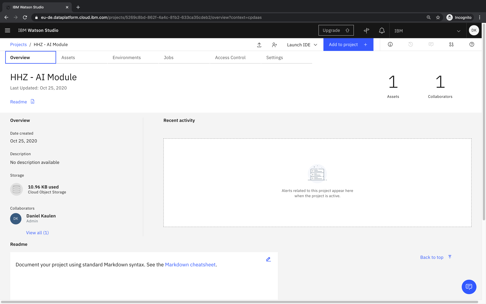
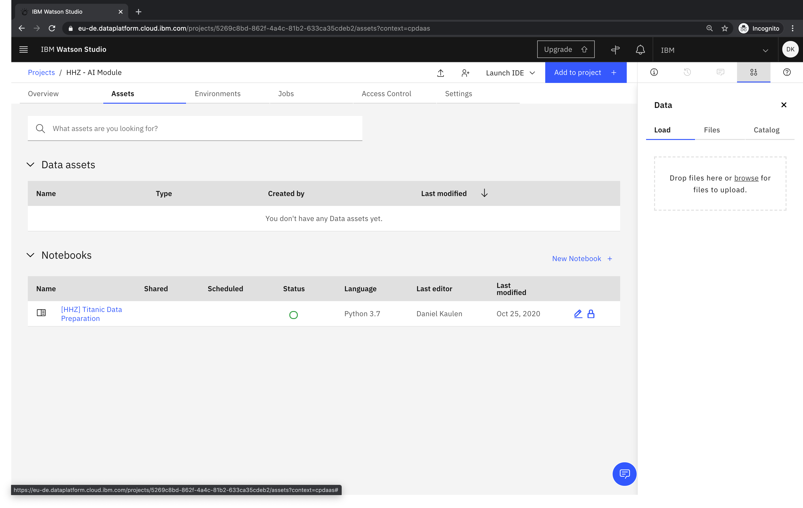
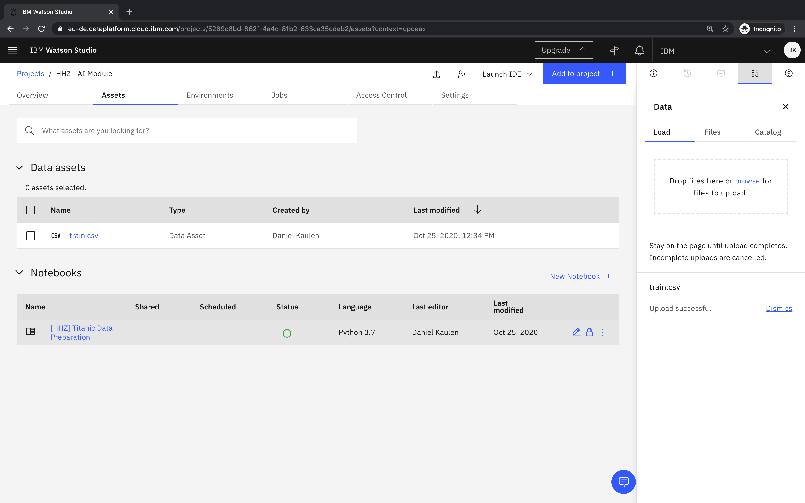

# How can I upload data assets to my project?

The approach described below is suitable for adding data assets (e.g. .csv, .xlsx) to your project. Notebooks files (.ipynb) must be created via a dedicated UI because it requires to specify additional metadata during the creation.   

- Access your project

- Switch to the _Assets_ tab and drop files in the drop zone, or click browse to upload

- The uploaded file appears in the _Data assets_ section

### Related links
- [Documentation - Adding data to a project](https://dataplatform.cloud.ibm.com/docs/content/wsj/manage-data/add-data-project.html)
